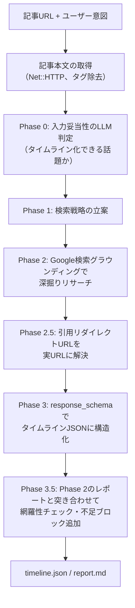

# news_timeline

ニュース記事のURLと「何を追いたいか」を入力すると、そのニュースの経緯を調査して、出典URL付きのタイムライン（JSON + Markdownレポート）を生成するgemです。Gemini APIのGoogle検索グラウンディングを使います。

もともとはニュースプラットフォーム「Ano News」のタイムライン自動生成機能として実装したものを、単体で試せるようにライブラリとして切り出しました。

## 課題と解法

LLMに「このニュースの経緯を時系列でまとめて」と1回のプロンプトで頼むと、それらしい日付と出来事をでっち上げた「時系列風の作文」が返ってきます。このgemは処理を4つのフェーズ（検索戦略の立案 → Google検索グラウンディングによる調査 → 構造化 → 網羅性検査）に分割し、事実の収集と文章の生成を分離することでこの問題に対処しています。さらに、グラウンディング検索の引用URLはリダイレクトURL（vertexaisearch.cloud.google.com）で返ってきて実際の情報源が見えないため、リダイレクトを追跡して実URLに解決し、検証済みURLだけを出典として使わせています。

## アーキテクチャ



ハルシネーション対策として「実在の出来事だけを扱う」「今日以降の日付を作らない」等の前提文を各フェーズのプロンプトに注入しています（Phase 2を除く。理由は後述の設計判断を参照）。

## 動く証拠

[examples/](examples/) に、児童手当制度の拡充を題材にした実際の生成結果（timeline.json / report.md）をコミットしてあります。

## クイックスタート

必要なもの: Ruby 3.2以上、Gemini APIキー（[Google AI Studio](https://aistudio.google.com/apikey) で無料で取得できます）。

```console
$ git clone https://github.com/rira100000000/news_timeline
$ cd news_timeline
$ bundle install
$ export GEMINI_API_KEY=あなたのAPIキー
$ bundle exec exe/news-timeline "https://www.cfa.go.jp/policies/kokoseido/jidouteate" "児童手当制度の拡充の経緯を知りたい"
```

数分かかります（フェーズごとに進捗が表示されます）。完了するとカレントディレクトリに `timeline.json` と `report.md` が生成されます。

オプションは2つだけです。

```console
$ news-timeline <URL> "<追いたい話題>" [--model MODEL] [--output-dir DIR]
```

ライブラリとして使う場合:

```ruby
require "news_timeline"

generator = NewsTimeline::Generator.new(api_key: ENV["GEMINI_API_KEY"])
result = generator.generate(
  url: "https://example.com/news/...",
  user_intent: "この問題の経緯を知りたい"
)

result[:title]       # => タイムラインのタイトル
result[:description] # => 概要
result[:blocks]      # => [{ event_year:, event_month:, event_day:, title:, content:,
                     #       evidence_source_urls:, position: }, ...]
```

`Generator.new` はこのほか `model:`（使用モデル）、`logger:`（進捗ログの出力先）、`prompt_dir:`（プロンプトテンプレートの差し替え）、`transcript_path:`（全プロンプト・レスポンスのログをファイルに保存。デフォルト無効）を受け取ります。

## 設計判断

**1. 1回のプロンプトではなく多段フェーズに分割する。**
単発プロンプトでは、検索も構成も文章化も同時にやらせることになり、検索が不十分なまま「それらしい」出来事で埋められてしまいます。「どう調べるか（Phase 1）」「調べる（Phase 2）」「構造化する（Phase 3）」「抜けを検査する（Phase 3.5）」を独立したLLM呼び出しに分けることで、各フェーズの出力を次フェーズの入力として検証・制約できます。特にPhase 3.5は、Phase 2の調査レポートとPhase 3のタイムラインを突き合わせて欠落した重要な出来事を補うためのフェーズで、これがないと構造化の際に出来事がしばしば脱落します。

**2. ハルシネーション対策の前提文を、Phase 2にだけ意図的に入れない。**
「実在の情報源のみ使用」「不確実な情報は明記」といった前提文はハルシネーションを抑える一方、Phase 2に入れるとモデルが保守的になり、グラウンディング検索の実行そのものを抑制することがありました。Phase 2は「必ずGoogle検索を実行する」ことが最優先のフェーズなので、前提文は入れず、代わりに検索結果の裏付け（グラウンディングチャンク）と後段のURL検証で事実性を担保しています。

**3. グラウンディング引用URLはリダイレクトを追跡して実URLに解決する。**
Geminiのグラウンディング検索が返す引用URLは `vertexaisearch.cloud.google.com/grounding-api-redirect/...` 形式のリダイレクトURLで、そのままでは読者に情報源を提示できません。Phase 2.5で各URLのリダイレクトを追跡して実URLに解決し、解決できたURLだけを「検証済みURL一覧」としてPhase 3/3.5に渡します。プロンプト側でも「この一覧以外のURLを使わない」よう制約し、最後の整形処理でも残存リダイレクトURLを除去する、という三段構えでURLのでっち上げを防いでいます。

## 出力形式

`timeline.json`（`Generator#generate` の戻り値と同じ構造）:

```json
{
  "title": "タイムラインのタイトル",
  "description": "概要",
  "blocks": [
    {
      "event_year": 2024,
      "event_month": 6,
      "event_day": 5,
      "title": "出来事の見出し",
      "content": "何が起きたかの説明",
      "evidence_source_urls": ["https://..."],
      "position": 0
    }
  ]
}
```

`report.md` は同じ内容を人が読みやすいMarkdownに整形したものです。

## 技術スタック

- Ruby 3.2+（Railsに依存しない、素のRubyライブラリ）
- [ruby-gemini-api](https://github.com/rira100000000/ruby-gemini-api) — 自作のGemini APIクライアント。Google検索グラウンディング・response_schema・URL Contextに対応
- Gemini 2.5 Flash（デフォルト。`--model` で変更可。ただしPhase 2はグラウンディング検索の安定動作を確認済みのモデルに固定）
- RSpec + WebMock（実APIを呼ばないテスト）

## 開発

```console
$ bundle install
$ bundle exec rake        # rspec + rubocop
```

## ライセンス

[MIT License](LICENSE.txt)
