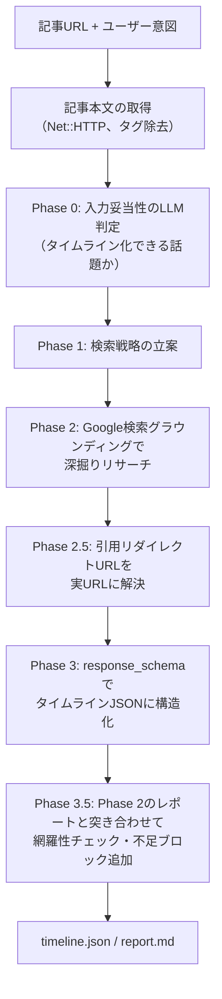

# news_timeline

ニュース記事のURLと「何を追いたいか」を入力すると、そのニュースの経緯を調査して、出典URL付きのタイムライン（JSON + Markdownレポート）を生成するgemです。Gemini APIのGoogle検索グラウンディングを使います。

もともとはニュースプラットフォーム「Ano News」のタイムライン自動生成機能として実装したものを、単体で試せるようにライブラリとして切り出しました。

## アーキテクチャ



## 生成結果の見本

[examples/](examples/) に、児童手当制度の拡充を題材にした実際の生成結果（timeline.json / report.md）をコミットしてあります。

## クイックスタート

必要なもの: Ruby 3.2以上、Gemini APIキー（[Google AI Studio](https://aistudio.google.com/apikey) で無料で取得できます）。

```console
$ git clone https://github.com/rira100000000/news_timeline
$ cd news_timeline
$ bundle install
$ export GEMINI_API_KEY=あなたのAPIキー
$ bundle exec exe/news-timeline "https://www.cfa.go.jp/policies/kokoseido/jidouteate" "児童手当制度の拡充の経緯を知りたい"
```

数分かかります（フェーズごとに進捗が表示されます）。完了するとカレントディレクトリに `timeline.json` と `report.md` が生成されます。

オプションは2つだけです。

```console
$ news-timeline <URL> "<追いたい話題>" [--model MODEL] [--output-dir DIR]
```

ライブラリとして使う場合:

```ruby
require "news_timeline"

generator = NewsTimeline::Generator.new(api_key: ENV["GEMINI_API_KEY"])
result = generator.generate(
  url: "https://example.com/news/...",
  user_intent: "この問題の経緯を知りたい"
)

result[:title]       # => タイムラインのタイトル
result[:description] # => 概要
result[:blocks]      # => [{ event_year:, event_month:, event_day:, title:, content:,
                     #       evidence_source_urls:, position: }, ...]
```

`Generator.new` はこのほか `model:`（使用モデル）、`logger:`（進捗ログの出力先）、`prompt_dir:`（プロンプトテンプレートの差し替え）、`transcript_path:`（全プロンプト・レスポンスのログをファイルに保存。デフォルト無効）を受け取ります。

## 出力形式

`timeline.json`（`Generator#generate` の戻り値と同じ構造）:

```json
{
  "title": "タイムラインのタイトル",
  "description": "概要",
  "blocks": [
    {
      "event_year": 2024,
      "event_month": 6,
      "event_day": 5,
      "title": "出来事の見出し",
      "content": "何が起きたかの説明",
      "evidence_source_urls": ["https://..."],
      "position": 0
    }
  ]
}
```

`report.md` は同じ内容を人が読みやすいMarkdownに整形したものです。

## 技術スタック

- Ruby 3.2+（Railsに依存しない、素のRubyライブラリ）
- [ruby-gemini-api](https://github.com/rira100000000/ruby-gemini-api) — 自作のGemini APIクライアント。Google検索グラウンディング・response_schema・URL Contextに対応
- Gemini 2.5 Flash（デフォルト。`--model` で変更可。ただしPhase 2はグラウンディング検索の安定動作を確認済みのモデルに固定）
- RSpec + WebMock（実APIを呼ばないテスト）

## 開発

```console
$ bundle install
$ bundle exec rake        # rspec + rubocop
```

## ライセンス

[MIT License](LICENSE.txt)
